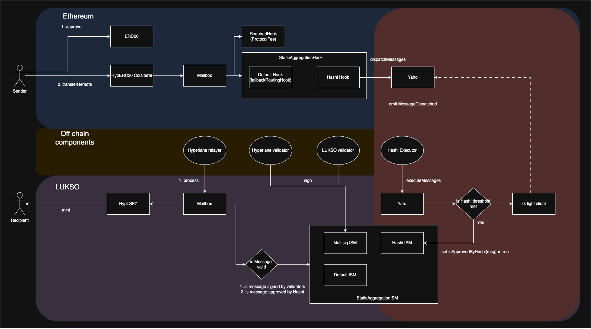
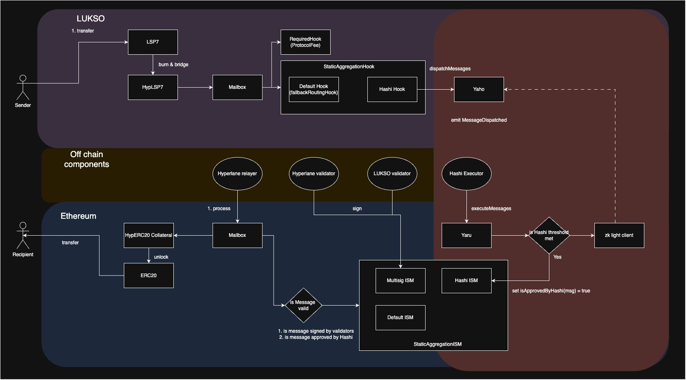

# LUKSO Tokenbridge

## Workflow (Ethereum → LUKSO)

**Ethereum**

1. User transfer ERC20 token to Hyp Collateral contract and the token is locked in the collateral contract.
2. Hyp Collateral contract call Mailbox to pass the message.
3. Mailbox call Default Hook (created by Hyperlane) and Hashi Hook (created by CCIA team).
4. Hashi Hook dispatch the token relaying message from Yaho contracts.

**Off chain**

1. Hashi [relayer](https://github.com/gnosis/hashi/tree/feat/v0.2.0/packages/relayer) (managed by CCIA team) will listen to event from Yaho contracts and request the reporter contracts to relay token relaying message.
2. Hashi [executor](https://github.com/gnosis/hashi/tree/feat/v0.2.0/packages/executor) (managed by CCIA team) will listen to event from each Hashi adapter contracts and call Yaru.executeMessages. This step will check whether the Hashi adapters agree on a specify message id (a threshold number of hash is stored), and set the message Id to verified status.
3. [Validator](https://docs.hyperlane.xyz/docs/protocol/agents/validators) (run by Hyperlane & LUKSO team) will sign the Merkle root when new dispatches happen in Mailbox.
4. [Hyperlane relayer](https://docs.hyperlane.xyz/docs/protocol/agents/relayer) (run by Hyperlane team) relays the message by calling Mailbox.process().

**LUKSO**

1. When Mailbox.process() is called, it will check with Multisig ISM (includes Hashi ISM), whether the message is signed by validators & verified by Hashi ISM. If so, it will mint hypERC20 token to the receiver.
2. For compatibility, LSP7 wrapper need to be created to mint LSP7 token to the user.

## Workflow ( LUKSO → Ethereum)

**LUKSO**

1. User transfer LSP7 token to HypERC20 contract and the token is burn.
2. HypERC20 contract call Mailbox to pass the message.
3. Mailbox call Default Hook (created by Hyperlane) and Hashi Hook (created by CCIA team).
4. Hashi Hook dispatch the token relaying message from Yaho contracts.

**Off chain**

1. Off chain process remains the same as before, except there is no Light Client support for Hashi from LUKSO → Ethereum.

**Ethereum**

1. When Mailbox.process() is called, it will check with Multisig ISM (includes Hashi ISM), whether the message is signed by validators & verified by Hashi ISM. If so, it will unlock ERC20 token to the receiver.

## Reference

### Hyperlane

1. Warp Route: https://github.com/hyperlane-xyz/hyperlane-monorepo/blob/main/solidity/contracts/token/README.md
2. Implement Connext xERC20 and Circle FiatToken collateral:https://github.com/hyperlane-xyz/hyperlane-monorepo/pull/3618
3. Hyperlane core contracts on LUKSO: https://github.com/hyperlane-xyz/hyperlane-registry/blob/main/chains/lukso/addresses.yaml

### Hashi

1. Hashi ISM: https://github.com/crosschain-alliance/lukso-tokenbridge/tree/main/contracts
2. Hashi: https://github.com/gnosis/hashi

### LUKSO

1. LSP7: https://docs.lukso.tech/standards/tokens/LSP7-Digital-Asset/
