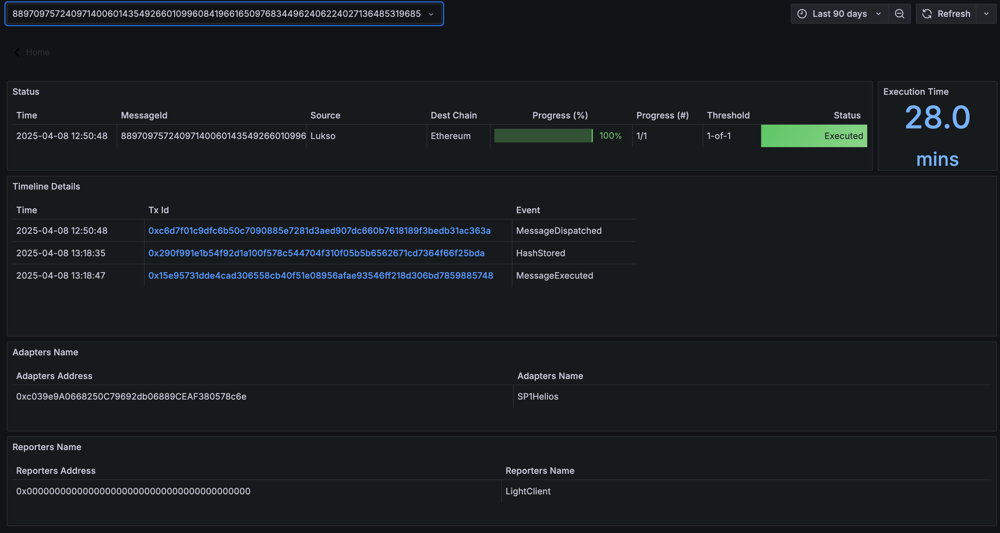

# Hashi API for LUKSO token bridge UI

This API allows users to check the status of a message being processed on the LUKSO blockchain through the Hashi bridge. By entering a transaction hash, the system will return whether the message has been detected or approved:

1. When a tx is originated on the source chain, one can check the status of a message by pasting the transactio hash. By calling https://hashi-explorer.xyz/api_bridge_ui/message_status?txhash=${TransactionHash}. The API returns `detected` when this event is emitted.
2. On destination chain, `MessageExecuted` event will emit for the same messageId. The API returns `approved` when this event is emitted.

## How to Use

Send a GET request to the following URL with your txhash

```
https://hashi-explorer.xyz/api_bridge_ui/message_status?txhash=0xYourTransactionHash
```

Response Format
The API will return a response in this format:

```
{
  "txhash": "0xYourTransactionHash",
  "messageId": "UniqueHashiMessageID",
  "status": "detected" | "approved"
}
```

## Open API spec

```openapi: 3.0.0
info:
  title: LUKSO Hashi Message Status API
  description: API to query the status of a message from Hashi on LUKSO
  version: 1.0.0
servers:
  - url: https://hashi-explorer.xyz/api_bridge_ui
    description: Production Server
paths:
  /message-status:
    get:
      summary: Get the status of a message from Hashi
      description: Returns the status of a message based on its transaction hash.
      parameters:
        - name: txhash
          in: query
          description: The transaction hash of the message
          required: true
          schema:
            type: string
            pattern: '^0x[a-fA-F0-9]{64}$'
      responses:
        '200':
          description: Successful response
          content:
            application/json:
              schema:
                type: object
                properties:
                  txhash:
                    type: string
                    pattern: '^0x[a-fA-F0-9]{64}$'
                    description: The transaction hash
                  messageId:
                    type: string
                    pattern: '^[0-9]+$''
                    description: The unique identifier of the message
                  status:
                    type: string
                    enum: ["detected", "approved"]
                    description: |
                      - "detected": Only `MessageDispatched` from the source chain's Yaho is detected.
                      - "approved": `MessageExecuted` for the same messageId has been detected.
        '400':
          description: Invalid request parameters
        '404':
          description: Message not found
        '500':
          description: Internal server error
```

## Example:

LUKSO -> Ethereum

1. Transaction: https://explorer.execution.mainnet.lukso.network/tx/0xc6d7f01c9dfc6b50c7090885e7281d3aed907dc660b7618189f3bedb31ac363a
2. Call https://hashi-explorer.xyz/api_bridge_ui/message_status?txhash=0xc6d7f01c9dfc6b50c7090885e7281d3aed907dc660b7618189f3bedb31ac363a
   Return

```json
{
  "messageId": "88970975724097140060143549266010996084196616509768344962406224027136485319685",
  "status": "approved",
  "txhash": "0xc6d7f01c9dfc6b50c7090885e7281d3aed907dc660b7618189f3bedb31ac363a"
}
```

By using the messageId, one can query on [Hashi Explorer](https://hashi-explorer.xyz)

URL: https://hashi-explorer.xyz/d/edklrl7qg7i80d/messages-status-2?orgId=1&var-messageId=88970975724097140060143549266010996084196616509768344962406224027136485319685&from=now-90d&to=now&timezone=browser  

